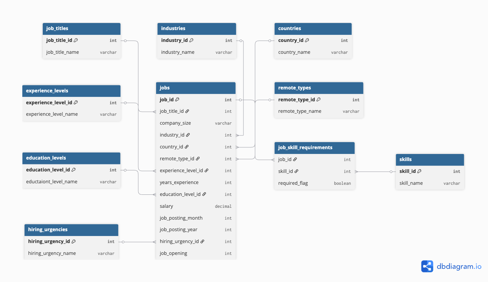

# 📊 AI Job Market SQL Analysis Project

## 🚀 Project Overview
This project models and analyzes AI job market trends using a normalized PostgreSQL database.  

Starting from a flat CSV dataset, the data was transformed into a structured relational schema to support scalable querying and real-world business analysis.

The objective of this project is to demonstrate:
- SQL proficiency (basic → advanced)
- Data modeling and normalization
- Analytical thinking using real-world job market data

---

## 🏗️ Data Modeling Approach

The original dataset was a single flat table containing job postings and skill indicators.

To improve query performance and reflect real-world database design, the dataset was normalized into multiple related tables:

- Fact table:
  - `jobs`

- Dimension tables:
  - `job_titles`
  - `industries`
  - `countries`
  - `remote_types`
  - `experience_levels`
  - `education_levels`
  - `hiring_urgencies`
  - `skills`

- Bridge table:
  - `job_skill_requirements` (many-to-many relationship)

This design enables efficient querying, scalability, and realistic SQL practice using joins and aggregations.

---

## 🧬 Schema Design

Key relationships:
- Each job links to a job title, industry, country, and experience level
- Skills are modeled using a many-to-many relationship
- Hiring urgency and job openings provide demand indicators

This structure allows for:
- Multi-table joins
- Skill-based filtering
- Aggregation across multiple dimensions

---

## 🔄 Data Pipeline

The data transformation process follows a structured pipeline:

1. Load raw CSV into a staging table (`staging_ai_jobs`)
2. Extract unique values into dimension tables
3. Populate the main `jobs` table using foreign keys
4. Convert skill indicator columns into a relational bridge table (`job_skill_requirements`)

---

## 📈 Example Business Questions

This project answers real-world analytical questions such as:

- What are the highest-paying AI job roles?
- Which countries have the most job openings?
- What skills are most in demand?
- Which skill combinations (e.g., Python + SQL) are most common?
- How does salary vary by experience level and remote type?

---

## 📊 Example Insights

- Senior-level roles consistently command the highest salaries
- Python and SQL are the most frequently required skills
- Remote roles often offer higher average salaries compared to on-site roles
- High hiring urgency correlates with increased job openings

---

## 🛠️ Tech Stack

- PostgreSQL / Supabase
- SQL (Joins, Aggregations, CTEs, Window Functions)
- Git & GitHub

---

## 📁 Project Structure

ai-job-market-sql-project/
│
├── data/
│   └── AI_Job_Market_Trends_2026.csv
│
├── sql/
│   ├── 01_create_schema.sql
│   ├── 02_create_staging_table.sql
│   ├── 03_insert_dimensions.sql
│   ├── 04_insert_jobs.sql
│   ├── 05_insert_skills.sql
│   └── 06_analysis_queries.sql
│
├── docs/
│   └── schema_diagram.png (optional)
│
└── README.md

---

## 🔥 Key Skills Demonstrated

- Relational database design
- Data normalization (1NF → 3NF concepts)
- Complex SQL querying
- Data transformation and pipeline thinking
- Analytical problem-solving

---

## 🚧 Future Improvements

- Add company-level data for deeper analysis
- Build a dashboard (Power BI / Looker)
- Integrate with a frontend using Supabase
- Expand dataset with additional time-series data

---

## 👤 Author

**George Knight**  
Data Science & Analytics  